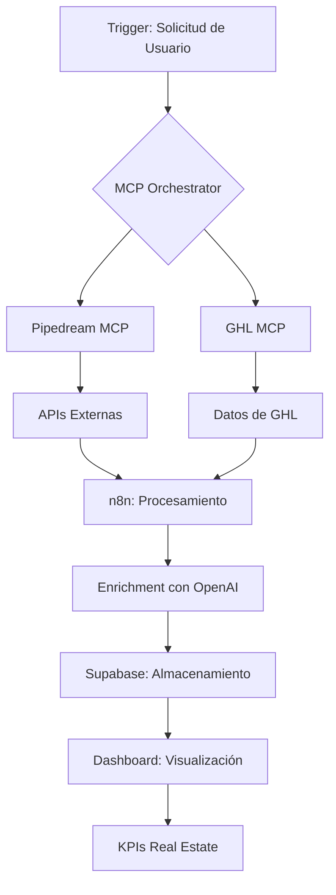

# Investigación de Capacidades MCP - Pipedream & GoHighLevel

**Fecha**: 2025-10-30
**Proyecto**: Ecosistema de Ecosistemas 360 con IA
**Objetivo**: Documentar capacidades y crear integración MCP para extracción de datos de Real Estate

---

## Resumen Ejecutivo

Esta investigación documenta las capacidades de los servidores MCP (Model Context Protocol) de Pipedream y GoHighLevel, con el objetivo de crear una integración robusta para extraer datos de CRM inmobiliario y generar reportes y KPIs estratégicos.

---

## 1. Pipedream MCP Server

### 1.1 Descripción General

El servidor MCP de Pipedream permite que asistentes de IA (como Claude o ChatGPT) accedan e interactúen de forma segura con más de **2,900 APIs** a través de un protocolo de comunicación estandarizado.

### 1.2 Capacidades Principales

#### **Integración Extensiva**
- Acceso a **10,000+ herramientas preconstruidas**
- Servicios populares incluidos: Slack, GitHub, Notion, Google Drive
- **Relevante para nuestro proyecto**: n8n, OpenAI, Supabase, webhooks

#### **Autenticación y Seguridad**
- Credenciales encriptadas en reposo
- Las solicitudes se realizan a través de servidores de Pipedream (nunca se exponen credenciales a los modelos de IA)
- OAuth gestionado automáticamente
- Los usuarios pueden revocar acceso en cualquier momento

#### **Opciones de Despliegue**
1. **Local**: `npx @pipedream/mcp`
2. **Auto-hospedado**: Para tu empresa o aplicación
3. **Hospedado por Pipedream**: Servidores MCP alojados

#### **Arquitectura**
Cada aplicación tiene su propio servidor MCP dedicado con herramientas específicas para esa API.

**Dos interfaces disponibles**:
- **Stdio**: Entrada/salida estándar. Ideal para editores y clientes MCP locales
- **SSE**: Server-Sent Events. Para servidores MCP orientados a internet

### 1.3 Casos de Uso para Real Estate

```yaml
Automatización de Productividad:
  - Agendar reuniones con clientes potenciales
  - Enviar emails de seguimiento automatizados
  - Crear documentos de propuestas

Análisis de Datos:
  - Consultar bases de datos de propiedades
  - Analizar hojas de cálculo de ventas
  - Generar reportes de rendimiento

Creación de Contenido:
  - Publicar actualizaciones en redes sociales sobre propiedades
  - Crear materiales de marketing
  - Generar descripciones de listados

Soporte al Cliente:
  - Responder consultas sobre propiedades
  - Crear tickets de soporte
  - Actualizar registros en CRM

Flujos de Desarrollador:
  - Crear issues para bugs
  - Revisar código de automatizaciones
  - Desplegar aplicaciones
```

---

## 2. GoHighLevel MCP Server

### 2.1 Descripción General

El servidor MCP de GoHighLevel (GHL) es un protocolo estandarizado y seguro que permite a agentes de IA leer y escribir datos en GoHighLevel **sin necesidad de SDKs** o integraciones personalizadas profundas.

**Estado**: ✅ **LIVE** y listo para uso

### 2.2 Capacidades Principales

#### **Cobertura Completa de API**
Acceso a **269+ herramientas API** incluyendo:

- **Contactos** (Contacts)
- **Conversaciones** (Conversations)
- **Calendarios** (Calendars)
- **Oportunidades** (Opportunities)
- **Pagos** (Payments)
- **Flujos de trabajo** (Workflows)
- **Posts de blog** (Blog Posts)
- **Media**
- **Y mucho más...**

#### **Autenticación Flexible**
- **OAuth 2.0**
- **Tokens de Integración Privada** (Private Integration Tokens - PITs)

#### **Configuración de Autenticación**

```bash
# Paso 1: Crear Token en GoHighLevel
1. Ir a Settings > Private Integrations
2. Clic en "Create New Integration"
3. Elegir los scopes requeridos
4. Copiar el token generado

# Paso 2: Configurar endpoint MCP
URL: https://services.leadconnectorhq.com/mcp/
Headers:
  - Authorization: Bearer YOUR_TOKEN
  - locationId: YOUR_LOCATION_ID
```

### 2.3 Integración con n8n

El servidor MCP se puede integrar con n8n añadiendo:
- **Nodo**: MCP Client
- **URL**: `https://services.leadconnectorhq.com/mcp/`
- **Protocolo de transporte**: HTTP Streamable
- **Requisito**: n8n v1.104 o posterior

### 2.4 Casos de Uso para Real Estate

#### **Gestión de Leads Inmobiliarios**

```javascript
// Ejemplo conceptual de comandos en lenguaje natural
"Obtén todos los contactos creados esta semana con interés en propiedades en Tulum"
"Muéstrame las oportunidades en la etapa 'Visita Agendada' con presupuesto > $500k"
"Crea un reporte de conversión por fuente de leads del último mes"
```

#### **Automatización de Comunicación**

- Auto-responder preguntas comunes sobre propiedades
- Integrar MCP con chatbots
- Encadenar múltiples acciones MCP para crear flujos de trabajo complejos

#### **Extracción de Datos para Reportes**

```yaml
Datos de Contactos:
  - Información demográfica
  - Historial de interacciones
  - Preferencias de propiedades
  - Presupuestos

Datos de Oportunidades:
  - Pipeline de ventas
  - Etapas del proceso
  - Valores monetarios
  - Probabilidad de cierre

Datos de Calendario:
  - Citas agendadas
  - Visitas a propiedades
  - Reuniones de seguimiento
  - Tasa de asistencia

Datos de Conversaciones:
  - Mensajes intercambiados
  - Tiempo de respuesta
  - Sentimiento del cliente
  - Temas frecuentes
```

---

## 3. Arquitectura de Integración Propuesta

### 3.1 Stack Tecnológico Integrado

```
┌─────────────────────────────────────────────────────────────┐
│                    CAPA DE INTELIGENCIA                      │
│                  (Claude + MCP Protocol)                     │
└────────────────────┬────────────────────────────────────────┘
                     │
        ┌────────────┴────────────┐
        │                         │
        ▼                         ▼
┌───────────────┐         ┌──────────────┐
│  Pipedream    │         │  GoHighLevel │
│  MCP Server   │         │  MCP Server  │
│  (2,900 APIs) │         │  (269 tools) │
└───────┬───────┘         └──────┬───────┘
        │                        │
        │     ┌──────────────────┘
        │     │
        ▼     ▼
┌─────────────────────────────────────────┐
│          n8n Orchestrator               │
│     (Flujos de trabajo + Agentes)       │
└─────────────┬───────────────────────────┘
              │
              ▼
┌─────────────────────────────────────────┐
│         Supabase Database               │
│   (Almacenamiento + Analytics)          │
└─────────────────────────────────────────┘
              │
              ▼
┌─────────────────────────────────────────┐
│      Dashboard de Reportes y KPIs       │
│        (Next.js + Visualización)        │
└─────────────────────────────────────────┘
```

### 3.2 Flujo de Datos Propuesto



---

## 4. KPIs y Reportes para Real Estate

### 4.1 KPIs Operacionales

#### **Generación de Leads**

```typescript
interface LeadGenerationKPIs {
  totalLeads: number;              // Total de leads capturados
  leadsBySource: {                 // Leads por fuente
    facebook: number;
    google: number;
    referral: number;
    website: number;
  };
  costPerLead: number;             // Costo por lead
  leadQualityScore: number;        // Score de calidad (1-10)
  responseTime: number;            // Tiempo promedio de respuesta (minutos)
  contactRate: number;             // % de leads contactados
}
```

#### **Conversión de Ventas**

```typescript
interface SalesConversionKPIs {
  conversionRate: number;          // % de leads que cierran
  averageDealValue: number;        // Valor promedio de venta
  salesCycleLength: number;        // Días promedio para cerrar
  opportunitiesByStage: {          // Oportunidades por etapa
    newLead: number;
    qualified: number;
    visitScheduled: number;
    proposalSent: number;
    negotiation: number;
    closed: number;
  };
  winRate: number;                 // % de oportunidades ganadas
  revenueForecasted: number;       // Ingresos proyectados
}
```

#### **Actividad del Equipo**

```typescript
interface TeamActivityKPIs {
  callsMade: number;               // Llamadas realizadas
  emailsSent: number;              // Emails enviados
  meetingsScheduled: number;       // Reuniones agendadas
  visitsCompleted: number;         // Visitas completadas
  averageResponseTime: number;     // Tiempo promedio de respuesta
  agentProductivity: {             // Productividad por agente
    agentId: string;
    leadsHandled: number;
    conversions: number;
    revenue: number;
  }[];
}
```

### 4.2 KPIs Estratégicos

#### **Eficiencia de Marketing**

```typescript
interface MarketingEfficiencyKPIs {
  roi: number;                     // Retorno de inversión
  cac: number;                     // Costo de adquisición de cliente
  ltv: number;                     // Valor de vida del cliente
  marketingSpend: number;          // Gasto en marketing
  revenueGenerated: number;        // Ingresos generados
  campaignPerformance: {           // Rendimiento por campaña
    campaignId: string;
    impressions: number;
    clicks: number;
    conversions: number;
    cost: number;
    revenue: number;
  }[];
}
```

#### **Salud del Pipeline**

```typescript
interface PipelineHealthKPIs {
  pipelineValue: number;           // Valor total del pipeline
  pipelineVelocity: number;        // Velocidad del pipeline (días)
  stagnantOpportunities: number;   // Oportunidades estancadas
  avgTimeByStage: {                // Tiempo promedio por etapa
    stage: string;
    days: number;
  }[];
  foreccastAccuracy: number;       // Precisión de pronósticos (%)
}
```

---

## 5. Plan de Implementación

### 5.1 Fase 1: Configuración Inicial (Semana 1-2)

**Objetivos**:
- ✅ Investigar capacidades de MCPs (COMPLETADO)
- 🔄 Configurar tokens y autenticación
- 🔄 Establecer conexión básica MCP con GHL

**Tareas**:
1. Crear Private Integration Token en GoHighLevel
2. Configurar MCP client en n8n
3. Probar conexión y extracción básica de datos
4. Documentar proceso de autenticación

### 5.2 Fase 2: Extracción de Datos (Semana 3-4)

**Objetivos**:
- Crear flujos de trabajo en n8n para extracción de datos
- Mapear estructura de datos de GHL a nuestro modelo
- Implementar almacenamiento en Supabase

**Tareas**:
1. Diseñar esquema de base de datos en Supabase
2. Crear workflows de extracción para:
   - Contactos
   - Oportunidades
   - Conversaciones
   - Calendario
3. Implementar transformación y enriquecimiento de datos
4. Configurar sincronización periódica

### 5.3 Fase 3: Cálculo de KPIs (Semana 5-6)

**Objetivos**:
- Implementar lógica de cálculo de KPIs
- Crear vistas materializadas en Supabase
- Desarrollar API endpoints para el dashboard

**Tareas**:
1. Implementar funciones de cálculo de KPIs en Supabase
2. Crear stored procedures para agregaciones complejas
3. Diseñar API REST para consumo del dashboard
4. Implementar caché para optimizar rendimiento

### 5.4 Fase 4: Dashboard y Visualización (Semana 7-8)

**Objetivos**:
- Desarrollar dashboard interactivo
- Implementar visualizaciones de KPIs
- Configurar alertas y notificaciones

**Tareas**:
1. Diseñar interfaz de usuario del dashboard
2. Implementar gráficos y visualizaciones
3. Crear sistema de filtros y drill-down
4. Implementar exportación de reportes

---

## 6. Casos de Uso Prácticos

### 6.1 Caso de Uso 1: Reporte Diario Automatizado

**Descripción**: Generar automáticamente un reporte diario con métricas clave para el equipo de ventas.

**Flujo**:
```
1. Trigger diario (8:00 AM)
2. MCP GHL extrae datos de las últimas 24h
3. n8n calcula KPIs
4. OpenAI genera insights en lenguaje natural
5. Email automatizado al equipo con reporte
```

**Métricas incluidas**:
- Nuevos leads capturados
- Conversiones del día
- Oportunidades avanzadas en pipeline
- Citas agendadas para hoy
- Alertas de leads de alta prioridad

### 6.2 Caso de Uso 2: Análisis de Sentimiento de Clientes

**Descripción**: Analizar conversaciones para detectar clientes insatisfechos o de alta prioridad.

**Flujo**:
```
1. MCP GHL extrae conversaciones nuevas cada hora
2. OpenAI analiza sentimiento y urgencia
3. n8n clasifica leads por prioridad
4. Notificación inmediata para leads críticos
5. Dashboard actualiza score de satisfacción
```

### 6.3 Caso de Uso 3: Predicción de Cierre

**Descripción**: Predecir probabilidad de cierre basado en datos históricos y comportamiento.

**Flujo**:
```
1. MCP GHL extrae todas las oportunidades activas
2. Supabase recupera datos históricos similares
3. Modelo de IA predice probabilidad de cierre
4. Dashboard muestra forecast ajustado
5. Alertas para oportunidades en riesgo
```

---

## 7. Próximos Pasos Inmediatos

### Acción 1: Configurar Autenticación GHL
```bash
# Tareas pendientes:
[ ] Acceder a GoHighLevel Settings
[ ] Crear Private Integration
[ ] Seleccionar scopes necesarios:
    - contacts.readonly
    - opportunities.readonly
    - conversations.readonly
    - calendars.readonly
[ ] Guardar token de forma segura
```

### Acción 2: Crear Flujo de Prueba en n8n
```bash
# Objetivo: Extraer 10 contactos de GHL
[ ] Añadir nodo MCP Client en n8n
[ ] Configurar conexión a GHL MCP
[ ] Crear comando: "Get last 10 contacts"
[ ] Verificar respuesta
[ ] Guardar resultado en Supabase
```

### Acción 3: Documentar Estructura de Datos
```bash
[ ] Mapear campos de Contactos GHL
[ ] Mapear campos de Oportunidades GHL
[ ] Diseñar esquema de tablas en Supabase
[ ] Crear script de migración
```

---

## 8. Recursos y Referencias

### Documentación Oficial

- **Pipedream MCP**: https://pipedream.com/docs/connect/mcp
- **GoHighLevel MCP**: https://marketplace.gohighlevel.com/docs/other/mcp/
- **MCP Protocol Spec**: https://modelcontextprotocol.io

### Repositorios GitHub

- **Pipedream MCP**: https://github.com/pipedream/mcp
- **GHL MCP (Community)**: https://github.com/mastanley13/GoHighLevel-MCP
- **GHL MCP (Drausal)**: https://github.com/drausal/gohighlevel-mcp

### Tutoriales y Guías

- **How to Use HighLevel MCP**: https://help.gohighlevel.com/support/solutions/articles/155000005741
- **n8n + MCP Integration**: Disponible en n8n v1.104+

---

## 9. Conclusiones

### Viabilidad Técnica
✅ **ALTA** - Ambos MCPs están en producción y bien documentados

### Complejidad de Implementación
🟡 **MEDIA** - Requiere configuración inicial pero con guías claras

### Valor Estratégico
✅ **MUY ALTO** - Permite automatización completa del ecosistema de datos

### Recomendación
**PROCEDER** con la implementación siguiendo el plan por fases propuesto.

---

**Elaborado por**: Claude + Roger García Vital
**Fecha**: 2025-10-30
**Versión**: 1.0
**Estado**: En desarrollo activo
